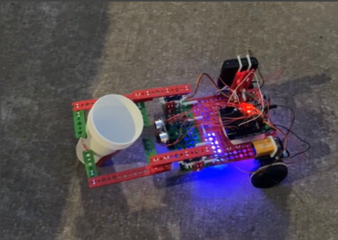
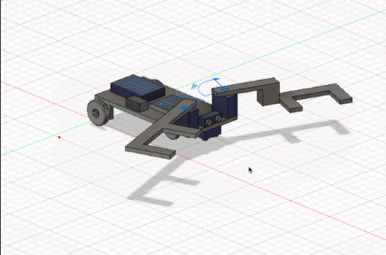
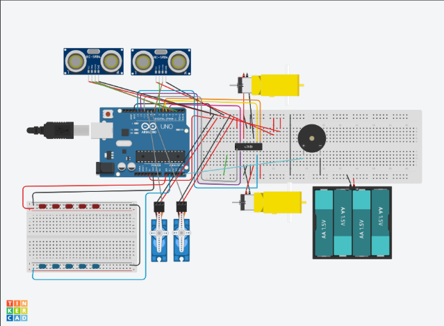

# Party Crasher — Autonomous Apprehension Robot

An autonomous robot that detects, pursues, and captures targets using ultrasonic sensing, servo-actuated claws, and police-themed audiovisual feedback. Designed as both an educational toy and a proof-of-concept for law enforcement robotics.

**YouTube Demo:** [https://youtu.be/K1cG0pb9A2w](https://youtu.be/K1cG0pb9A2w)



---

## Project Overview

**Party Crasher** is an autonomous wheeled robot that mimics law enforcement behavior through target detection, pursuit, capture, and extraction. The robot combines sensor fusion, state-machine control, and mechanical actuation to perform a complete apprehension sequence with police car-inspired lights and siren effects.

### Mission Sequence

1. **Patrol Mode** — Robot moves forward, scanning for targets with front ultrasonic sensor (blue LED indicator)
2. **Target Detection** — Object detected within 6 cm threshold triggers capture sequence
3. **Apprehension** — Servo-actuated claws close, siren activates, red/blue LEDs alternate (police effect)
4. **Extraction** — Robot reverses with captured target for 1.5 seconds
5. **Edge Detection** — Bottom ultrasonic sensor detects table edge (>10 cm ground clearance)
6. **Emergency Stop** — Robot reverses, stops, and sounds alarm (mission complete)

### Design Philosophy

**Target Application:** Educational toy demonstrating robotics concepts (sensing, actuation, control logic)  
**Proof-of-Concept:** Potential law enforcement application for non-lethal suspect apprehension

---

## System Architecture

### Hardware Components

**Locomotion:**
- 2× DC gearhead motors (rear drive)
- 4× wheels (2 driven, 2 passive front casters)
- Motor shield (eliminates H-bridge wiring complexity)

**Sensing:**
- 2× HC-SR04 ultrasonic sensors
  - **Front sensor:** Target detection (0-200 cm range)
  - **Bottom sensor:** Edge detection (ground proximity)

**Actuation:**
- 2× SG90 servo motors (180° rotation)
- Custom claw mechanism (asymmetric design)

**Feedback:**
- Piezo buzzer (siren: 700-800 Hz sweep, beeps: 50-400 Hz)
- 5× Red LEDs + 5× Blue LEDs (alternating police pattern)

**Control:**
- Arduino Uno (ATmega328P microcontroller)
- Motor shield (motor control, PWM speed control)

**Power:**
- 9V battery (Arduino/servos)
- 4× AA batteries (6V for DC motors)

---

## Mechanical Design

### Claw Mechanism



*Asymmetric dual-arm design with secondary linkages for secure grip on tapered objects*

**Design Challenge:** Capture cylindrical objects (cups) with varying diameter along their height.

**Solution — Asymmetric Dual-Arm Design:**

| Feature | Implementation | Rationale |
|---------|---------------|-----------|
| **Arm spacing** | Motor mounts positioned to span widest cup diameter | Ensures capture regardless of orientation |
| **Vertical offset** | Arms at different heights | Prevents collision, avoids ultrasonic obstruction |
| **Secondary links** | 2 smaller linkages per arm | Secures tapered sections arms can't reach |
| **Arm length** | Extended reach beyond sensor range | Allows capture while robot maintains forward velocity |

**Grip Sequence:**
1. Servos in released position: Left=165°, Right=15° (open)
2. Target detected (<6 cm) → servos actuate
3. Servos in locked position: Left=5°, Right=175° (closed)
4. Secondary links conform to cup taper
5. Grip maintained until extraction complete

**CAD Design:** Fusion 360 model (`Party_Crasher_v9.f3d`) demonstrates asymmetric claw geometry and servo mounting.

---

## Electronics & Wiring



*Complete wiring schematic showing Arduino, motor shield, sensors, and feedback systems*

### Pin Configuration

**Motor Control (Motor Shield):**
```
Motor 1 (Right):
- Enable: Pin 6 (PWM)
- Input 1: Pin 5
- Input 2: Pin 4

Motor 2 (Left):
- Enable: Pin 11 (PWM)
- Input 1: Pin 12
- Input 2: Pin 13
```

**Servo Control:**
```
Left Servo:  Pin 10 (PWM)
Right Servo: Pin 9 (PWM)
```

**Sensors:**
```
Front Ultrasonic:
- Trig: Pin 7
- Echo: Pin 8

Bottom Ultrasonic:
- Trig: Pin 2
- Echo: Pin 3
```

**Feedback:**
```
Buzzer:    Pin A5 (analog output)
Red LEDs:  Pin A0 (via breadboard)
Blue LEDs: Pin A1 (via breadboard)
```

**Input:**
```
Start Switch: Pin 1 (digital input)
```

### Circuit Diagram

**Simplified Architecture:**

```
Arduino Uno + Motor Shield
│
├─ Motor Shield → DC Motors (6V supply)
├─ Pins 9,10 → Servo Motors (5V from Arduino)
├─ Pins 2,3,7,8 → Ultrasonic Sensors (5V logic)
├─ Pin A5 → Piezo Buzzer
├─ Pins A0,A1 → LED Arrays (breadboard)
└─ Pin 1 → Start Switch
```

**Power Distribution:**
- **Arduino/Logic:** 9V battery
- **DC Motors:** 4×AA (6V) through motor shield
- **Servos:** 5V regulated from Arduino
- **Sensors/LEDs:** 5V from Arduino

**Motor Shield Advantage:** Eliminates need for external H-bridge circuit (L298N, etc.), simplifies wiring, provides integrated PWM speed control.

---

## Software Architecture

### State Machine Control

The robot operates as a **finite state machine** with six distinct modes:

| State | Trigger | Actions | LED | Sound | Next State |
|-------|---------|---------|-----|-------|------------|
| **INIT** | Power on | Grip test, release, timer setup | Blue solid | None | FORWARD |
| **FORWARD** | Default patrol | Drive forward, scan front sensor | Blue solid | Beep (400 Hz) | CUP or STOP |
| **CUP** | Front sensor <6 cm | Close grip, continue forward | Red/Blue alternate | Siren (700-800 Hz) | REVERSE |
| **REVERSE** | Cup captured | Drive backward 1.5 sec | Blue solid | Tone (150 Hz) | STOP |
| **STOP** | Timer expires or edge detected | Motors off | Red solid | Beep (500 Hz, 1 sec) | (terminal) |
| **EDGE_DETECTED** | Bottom sensor >10 cm | Emergency reverse, stop | Red solid | Beep | STOP |

**State Transition Logic:**

```cpp
// Simplified control flow
if (mode == "forward") {
    forward();
    if (cmFront < 6) → mode = "cup";
    if (cmBottom > 10) → mode = "stop" (emergency);
}

if (mode == "cup") {
    gripLock();
    if (cmFront >= 6) → mode = "reverse";
}

if (mode == "reverse") {
    reverse();
    if (reverseTimer.tick()) → mode = "stop";
}
```

---

### Object-Oriented Code Structure

**Custom Classes:**

**1. Timer Class**
```cpp
class Timer {
    double timeout, start;
    void reset();
    void setTimeout(double t);
    bool tick();  // Returns true when timeout expires
    double elapsed();
};
```
**Purpose:** Non-blocking timing for state transitions, LED blinks, audio patterns

**2. LEDHandler Class**
```cpp
class LEDHandler {
    const int LED_RED = A0;
    const int LED_BLUE = A1;
    void LED_TOGGLE_BLINK();  // Alternates red/blue every 100ms
    void RED_ON(), BLUE_ON(), LED_OFF();
};
```
**Purpose:** Police car light effect (alternating red/blue pattern)

**3. Siren Class**
```cpp
class Siren {
    int frequency;  // 700-800 Hz sweep
    void start(), stop();
    void play();    // Frequency ramps up/down for siren effect
};
```
**Purpose:** Police siren audio (frequency modulation 700→800→700 Hz)

**4. Beep Class**
```cpp
class Beep {
    int frequency;
    void setFrequency(int f);
    void setTimeout(int t1, int t2);
    void play();  // Timed beep pattern
};
```
**Purpose:** Status indication (forward mode: 400 Hz, stop mode: 500 Hz)

---

### Core Functions

**Motion Control:**
```cpp
void forward()  // Both motors forward
void reverse()  // Both motors backward
void left()     // Differential: left back, right forward
void right()    // Differential: right back, left forward
void stop()     // All motors off
```

**Servo Control:**
```cpp
void gripLock()     // Close claws: Left=5°, Right=175°
void gripRelease()  // Open claws: Left=165°, Right=15°
```

**Ultrasonic Sensing:**
```cpp
double get_duration(int trig, int echo) {
    // Send 10µs trigger pulse
    // Measure echo pulse width
    return microsecondsToCentimeters(pulseIn(echo, HIGH));
}
```

**Distance Calculation:**
```cpp
// Speed of sound: 343 m/s
// Time for round trip: t = 2d/v
double microsecondsToCentimeters(double µs) {
    return µs / 29 / 2;  // Empirical calibration
}
```

---

### Control Flow

**Main Loop Logic:**

```cpp
void loop() {
    // Read sensors
    cmFront = get_duration(trigFront, echoFront);
    cmBottom = get_duration(trigBottom, echoBottom);
    
    // Edge detection (priority)
    if (cmBottom > 10 && mode == "forward") {
        reverse();
        delay(1500);
        stop();
        mode = "stop";
    }
    
    // Target detection
    if (cmFront < 6) {
        gripLock();
        siren.start();
        led_handler.LED_TOGGLE_BLINK();
        mode = "cup";
    }
    
    // State machine execution
    switch(mode) {
        case "forward":
            forward();
            beep.play();
            break;
        case "reverse":
            reverse();
            tone(buzzer, 150);
            if (reverseTimer.tick()) mode = "stop";
            break;
        case "stop":
            stop();
            beep.play();
            break;
    }
    
    siren.play();  // Updates frequency sweep if active
}
```

**Key Features:**
- **Non-blocking timing:** All delays handled through `Timer.tick()` checks
- **Sensor polling:** 20 Hz ultrasonic sampling (50 ms loop period)
- **Priority logic:** Edge detection overrides other states (safety)

---

## Bill of Materials

### Electronics

| Qty | Component | Part Number | Purpose |
|-----|-----------|-------------|---------|
| 1 | Arduino Uno | ATmega328P | Main controller |
| 1 | Motor Shield | N/A | DC motor driver (H-bridge replacement) |
| 2 | DC Gearhead Motor | N/A | Locomotion (rear wheels) |
| 2 | Servo Motor | SG90 | Claw actuation (180° rotation) |
| 2 | Ultrasonic Sensor | HC-SR04 | Distance measurement (0-200 cm) |
| 1 | Piezo Buzzer | N/A | Audio feedback (siren, beeps) |
| 5 | Red LED | N/A | Police light effect |
| 5 | Blue LED | N/A | Police light effect |
| 1 | 9V Battery | N/A | Arduino power |
| 4 | AA Battery (1.5V) | N/A | Motor power (6V total) |
| 1 | 400-pin Breadboard | N/A | LED wiring |
| 8 | Male-Female Wire | N/A | Sensor connections |
| 14 | Male-Male Wire | N/A | Breadboard connections |
| 2 | Rubber Band | N/A | Cable management |

### Mechanical (SnappyXO Components)

| Qty | Component | Purpose |
|-----|-----------|---------|
| 4 | Outer Wheel | Drive wheels (2) + caster wheels (2) |
| 2 | Inner Wheel | Motor shaft mounting |
| 2 | 2" O-Ring Tire | Wheel traction |
| 2 | Circular Rod 1" | Claw linkages |
| 2 | Circular Rod 2.5" | Claw linkages |
| 2 | 4X Channel Plate | Main chassis platform |
| 1 | 3X Channel Plate | Chassis support |
| 9 | 3X Beam | Structural framework |
| 9 | 2X Beam | Structural framework |
| 2 | 6X Beam | Claw arms |
| 2 | 8X Beam | Claw arms |
| 1 | 4X Beam | Servo mounting |
| 2 | Servo Horn 2X | Claw attachment to servo |
| 2 | DC Motor Mount | Motor chassis attachment |
| 2 | Servo Mount | Servo chassis attachment |
| 2 | Ultrasonic Sensor Mount | Sensor positioning |
| 17 | Small H Clip | Beam connections |
| 6 | Medium H Clip | Beam connections |
| 4 | Large H Clip | Beam connections |
| 6 | L Clip | Right-angle connections |
| 13 | C Clip | Perpendicular connections |
| 4 | Small Fixed Pivot | Claw linkage pivots |
| 6 | Spacer | Platform standoffs |

**Total Component Count:** 100+ parts  
**Build Time:** ~6-8 hours (assembly + wiring + programming)

---

## Key Design Features

### 1. Sensor Fusion for Autonomous Operation

**Dual Ultrasonic Configuration:**
- **Front sensor (horizontal):** Target detection, range 0-200 cm, 6 cm trigger threshold
- **Bottom sensor (vertical):** Edge detection, >10 cm indicates no ground surface

**Sensor Placement:**
- Front sensor: 90° to chassis, unobstructed view
- Bottom sensor: Beneath platform, downward-facing

**Challenge Solved:** Single-sensor systems can't differentiate between "target in range" and "approaching table edge" — dual sensors provide context-aware decision making.

---

### 2. Mechanical Adaptability

**Asymmetric Claw Design:**

Traditional symmetric claws fail on tapered objects (cups, bottles) because:
- Upper claw contacts wide diameter → loose grip
- Lower claw contacts narrow diameter → loose grip
- Object slips through

**Solution:**
- **Upper arm:** Higher position, contacts wide section
- **Lower arm:** Lower position, contacts narrow section  
- **Secondary links:** Fill gaps, conform to taper
- **Result:** Secure grip regardless of cup orientation

**Manufacturing:** Fusion 360 CAD → 3D printed linkages or SnappyXO beam assembly

---

### 3. State Machine Robustness

**Problem:** Simple if-else logic fails when multiple conditions overlap.

**Example Failure:**
```cpp
// BAD: Race condition
if (target_detected) grip();
if (edge_detected) reverse();
// What if both are true? Grip while reversing?
```

**Solution:** Explicit state machine with priority hierarchy:
1. **Edge detection** (highest priority — safety)
2. **Target capture** (mission objective)
3. **Patrol** (default behavior)

**States are mutually exclusive** — robot can only be in one mode at a time.

---

### 4. Audio-Visual Feedback

**Police Car Simulation:**

| Mode | Sound | Lights | Purpose |
|------|-------|--------|---------|
| Patrol | 400 Hz beep (200ms) | Blue solid | "On duty" indicator |
| Pursuit | 700-800 Hz siren sweep | Red/Blue alternate (100ms) | "In chase" effect |
| Extraction | 150 Hz tone | Blue solid | "Transporting" indicator |
| Complete | 500 Hz beep (1 sec) | Red solid | "Mission accomplished" |

**Frequency Selection:**
- Police sirens: 700-1800 Hz (actual range)
- Party Crasher: 700-800 Hz (within piezo buzzer optimal range)
- Sweep rate: 100 Hz/loop (~10 Hz modulation frequency)

---

## Technical Challenges & Solutions

### Challenge 1: Grip Timing

**Problem:** If claws close too early, robot pushes cup away. If too late, robot drives past.

**Solution:** 
- Trigger threshold: 6 cm (within claw reach)
- Continue forward motion during grip
- Servo actuation time: 500 ms (half the approach time)

**Calculation:**
```
Robot speed: ~10 cm/s
Detection range: 6 cm
Time to contact: 0.6 seconds
Servo close time: 0.5 seconds
Result: Claws fully closed before contact
```

---

### Challenge 2: Edge Detection False Positives

**Problem:** Ultrasonic sensor occasionally reads >10 cm over solid ground due to:
- Reflective surfaces
- Angled reading
- Acoustic noise

**Solution:**
- Threshold: 10 cm (conservative margin)
- Action: Immediate reverse 1.5 seconds (30 cm backstep)
- Only check during forward motion (ignored in reverse mode)

---

### Challenge 3: Motor Shield Integration

**Problem:** Traditional H-bridge (L298N) requires:
- 8 signal wires (4 per motor)
- 2 enable wires (PWM speed control)
- External power supply routing
- Complex breadboard layout

**Solution:** Arduino Motor Shield
- Direct Arduino pin mapping
- Integrated power regulation
- PWM channels pre-configured
- Cleaner wiring, fewer failure points

---

### Challenge 4: Non-Blocking Code

**Problem:** `delay()` freezes entire program — robot can't sense while waiting.

**Bad code:**
```cpp
void reverse() {
    setMotors(REVERSE);
    delay(1500);  // BLOCKED — can't detect edge!
}
```

**Solution:** Timer class with `tick()` method
```cpp
if (mode == "reverse") {
    reverse();
    if (reverseTimer.tick()) {  // Non-blocking check
        mode = "stop";
    }
    // Can still read sensors every loop iteration
}
```

---

## Code Architecture Highlights

### Class Design: Timer

**Purpose:** Replace blocking `delay()` with non-blocking timing.

**Key Methods:**
```cpp
void setTimeout(double ms);  // Set countdown duration
void reset();                // Restart timer from current time
bool tick();                 // Check if timeout expired (auto-resets)
double elapsed();            // Time since last reset
```

**Usage Pattern:**
```cpp
Timer reverseTimer;
reverseTimer.setTimeout(1500);  // 1.5 seconds

// In loop():
if (reverseTimer.tick()) {
    // Code here runs once after 1500ms
}
```

**Internal Logic:**
```cpp
bool tick() {
    bool expired = (millis() - start) > timeout;
    if (expired) start = millis();  // Auto-reset
    return expired;
}
```

---

### Class Design: LEDHandler

**Purpose:** Manage police light alternating pattern without blocking.

**Key Method:**
```cpp
void LED_TOGGLE_BLINK() {
    if (timer.tick()) {  // Every 100ms
        if (red_on) {
            RED_OFF();
            BLUE_ON();
        } else {
            BLUE_OFF();
            RED_ON();
        }
    }
}
```

**Usage:**
```cpp
LEDHandler led_handler;

// In loop():
if (mode == "cup") {
    led_handler.LED_TOGGLE_BLINK();  // Auto-alternates
}
```

**Effect:** Red/blue flashing at 5 Hz (100ms period) — visually similar to police lights.

---

### Class Design: Siren

**Purpose:** Generate frequency-swept siren sound.

**Frequency Modulation:**
```cpp
void play() {
    tone(buzzer, frequency);
    frequency += frequency_k;  // Ramp up or down
    
    if (frequency < 700 || frequency > 800) {
        frequency_k *= -1;  // Reverse direction
    }
}
```

**Audio Characteristics:**
- Range: 700-800 Hz (100 Hz sweep)
- Period: ~1 second full cycle
- Waveform: Triangle wave (linear ramp)

---

## Operation Guide

### Setup

1. **Power connection:**
   - Insert 9V battery → Arduino
   - Insert 4× AA batteries → motor pack
   - Switch on Arduino

2. **Initial state:**
   - Claws perform grip test (open → close → open)
   - Blue LED turns on (ready state)

3. **Placement:**
   - Position robot on flat surface
   - Ensure >30 cm clearance in front
   - Place target (cup) 10-50 cm ahead

4. **Start:**
   - Robot begins patrol automatically
   - Front sensor scans for obstacles

---

### Behavioral Sequence

**Phase 1: Patrol**
- Forward motion (~10 cm/s)
- Blue LED solid
- 400 Hz beep every 200ms
- Scanning range: 0-200 cm

**Phase 2: Target Acquired (cmFront < 6 cm)**
- Claws close (500ms actuation)
- Siren activates (700-800 Hz sweep)
- Red/blue LEDs alternate (100ms period)
- Continue forward motion

**Phase 3: Extraction (cup secured)**
- Reverse motion (1.5 seconds = ~15 cm)
- 150 Hz tone
- Blue LED solid
- Claws remain closed

**Phase 4: Mission Complete**
- Stop all motors
- 500 Hz beep (1 second pulse)
- Red LED solid
- Claws release

**Emergency: Edge Detected (cmBottom > 10 cm)**
- Immediate reverse (1.5 seconds)
- Stop
- Red LED + beep pattern
- Overrides all other states

---

## Future Improvements

### Hardware Enhancements

1. **IMU Integration** (MPU6050)
   - Gyroscope for turn rate control
   - Accelerometer for impact detection
   - Enables controlled turns, collision response

2. **Camera Vision** (OpenMV or ESP32-CAM)
   - Replace ultrasonic with object recognition
   - Color-based target selection
   - Face/shape detection

3. **Encoders on Motors**
   - Precise distance traveled measurement
   - Speed feedback for PID control
   - Odometry for dead reckoning

4. **Force Sensing in Claws**
   - FSR (force-sensitive resistor) in grip pads
   - Adaptive grip strength
   - Prevents crushing fragile objects

---

### Software Enhancements

1. **PID Motor Control**
   - Replace binary motor states with PWM speed control
   - Smooth acceleration/deceleration
   - Maintain constant speed regardless of terrain

2. **Kalman Filtering on Sensors**
   - Reduce ultrasonic noise
   - Fuse IMU + ultrasonic data
   - More reliable edge detection

3. **Behavior Tree Architecture**
   - Replace state machine with modular behavior tree
   - Easier to add new behaviors
   - Priority-based task execution

4. **Remote Telemetry**
   - Bluetooth/WiFi status reporting
   - Real-time sensor visualization
   - Manual override capability

---

### Mechanical Enhancements

1. **Omnidirectional Wheels (Mecanum)**
   - Strafe sideways to align with target
   - Reduces capture failure rate
   - More complex motor control

2. **Spring-Loaded Grip**
   - Passive compliance in claws
   - Absorbs shock during capture
   - Reduces motor stall risk

3. **Adjustable Wheelbase**
   - Telescoping chassis
   - Adapt to different target sizes
   - Improved stability

---

## Educational Value

### Concepts Demonstrated

| Concept | Implementation | Learning Outcome |
|---------|---------------|------------------|
| **Sensing** | Ultrasonic time-of-flight | Distance measurement principles |
| **Actuation** | Servo + DC motor control | Difference between position and velocity control |
| **Control Logic** | State machine design | Software architecture for robotics |
| **Real-Time Systems** | Non-blocking timing | Event-driven programming |
| **Object-Oriented Design** | C++ classes | Code modularity and reusability |
| **Sensor Fusion** | Dual ultrasonic interpretation | Context from multiple sources |
| **Mechanical Design** | Asymmetric linkage | Adaptation to non-uniform geometry |
| **Power Systems** | Dual battery configuration | Isolation of logic and motor power |

---

## Applications

**Educational:**
- STEM curriculum: robotics, programming, mechanical design
- Competition platform: RoboGames, FIRST Robotics concepts
- Interactive demonstration: school fairs, museum exhibits

**Research:**
- Non-lethal apprehension study
- Human-robot interaction (toy vs. utility perception)
- Autonomous capture mechanism benchmarking

**Consumer:**
- Pet toy (chase and capture mode)
- Security demonstration (intrusion response)
- Interactive party game ("catch the robot")

---

## Project Files

```
Party-Crasher/
├── robot_code.ino              # Arduino source code
├── Party_Crasher_v9.f3d        # Fusion 360 CAD model
├── robot.png                   # Assembled robot photo
├── electrical_diagram.png      # Wiring schematic
├── clawing_mechanism.png       # Claw mechanism close-up
└── README.md                   # This file
```

**Circuit Simulation:** [TinkerCAD Link](https://www.tinkercad.com/things/8K58ceJHaWl)

---

## Technical Specifications Summary

| Parameter | Specification |
|-----------|--------------|
| **Dimensions** | ~25 cm × 20 cm × 15 cm (L×W×H) |
| **Weight** | ~1.5 kg (estimated) |
| **Speed** | ~10 cm/s forward, ~8 cm/s reverse |
| **Detection Range** | 6-200 cm (front ultrasonic) |
| **Edge Detection** | >10 cm (bottom ultrasonic) |
| **Grip Closure Time** | 500 ms |
| **Grip Width** | 5-15 cm (adjustable via servo angle) |
| **Battery Life** | ~2 hours continuous operation |
| **Operating Surface** | Flat, hard surfaces (no carpet) |
| **Target Capacity** | Cylindrical objects, 200-500g, 5-10 cm diameter |

---

## Lessons Learned

### What Worked Well

1. **Motor shield simplicity** — Eliminated H-bridge wiring complexity, reduced failure points
2. **State machine clarity** — Easy to debug, clear behavioral logic
3. **Asymmetric claw design** — Consistently captured tapered objects
4. **Non-blocking timers** — Smooth multi-tasking without threading

### What Could Be Improved

1. **Sensor noise** — Ultrasonic occasionally misreads; Kalman filter would help
2. **Motor speed** — Binary on/off; PWM speed control would smooth motion
3. **Claw force** — No feedback; some objects crushed, others slipped
4. **Turn control** — No gyroscope; turns are imprecise

### Key Takeaways

- **Mechanical constraints drive software design** — Claw actuation time determined sensor trigger threshold
- **Sensor fusion is essential** — Single ultrasonic would confuse edge/target scenarios
- **State machines prevent race conditions** — Explicit mode prevents conflicting actions
- **User feedback is critical** — LEDs and sound made behavior interpretable

---

## Acknowledgments

**Hardware:** SnappyXO robotics kit  
**Development Environment:** Arduino IDE 1.8.19  
**CAD Software:** Autodesk Fusion 360  
**Circuit Simulation:** TinkerCAD  

**Special Thanks:** MEC 310 — Robotics course, Stony Brook University

---

## License

This project is open-source for educational purposes. Feel free to modify, improve, and share.

---

**Status:** ✅ Fully Operational — Video demonstration available on YouTube
